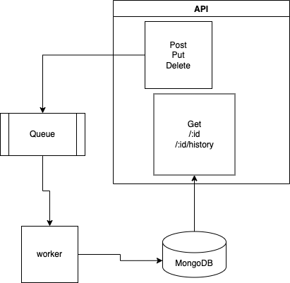
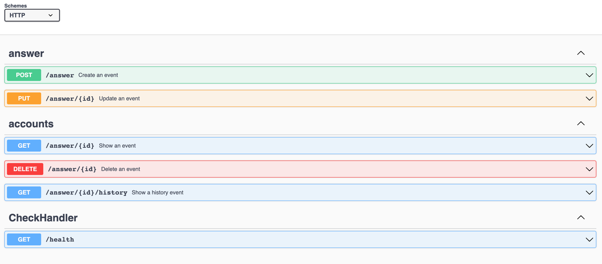

### Golang Answer events store microservice  👋. 
This application handlers the different states that can have a set of answers for user.

Here, we can use different options to manage the event state can have a group of answers.
* 
* Note: We have used package-oriented-design to create this API, you can know more about this
  [link](https://www.ardanlabs.com/blog/2017/02/package-oriented-design.html)

The requirements of this project have the following:

1. If a user saves the same key multiple times (using update), it should save every answer. When retrieving an answer, it should return the latest answer.

2. If a user tries to create an answer that already exists - the request should fail and an adequate message or code should be returned.

3. If an answer doesn't exist or has been deleted, an adequate message or code should be returned.

When returning history, only mutating events (create, update, delete) should be returned. The "get" events should not be recorded.

It is possible to create a key after it has been deleted. However, it is not possible to update a deleted key. For example the following event sequences are allowed:

    create → delete → create → update

    create → update → delete → create → update

However, the following should not be allowed:

    create → delete → update
    create → create

### System Design

 design of solution 

### Setup:

- Run follow command:

~~~bash
make setup
~~~

### Bind api:

~~~bash
make api-forward
~~~

### Remove all:

- Run follow command:

~~~bash
make remove-all
~~~

### Testing

~~~bash
make test
~~~

##Documentation API Swagger

To watch, please click in the next link:

http://localhost:8080/swagger/index.html#/

These are detail endpoints

#### 👨‍💻 Full list what has been used:
* [Kafka](https://github.com/segmentio/kafka-go) - Kafka library in Go
* [gin](https://github.com/gin-gonic/gin) - Web framework
* [swag](https://github.com/swaggo/swag) - Swagger
* [MongoDB](https://github.com/mongodb/mongo-go-driver) - The Go driver for MongoDB
* [Docker](https://www.docker.com/) - Docker
* [Docker test](https://github.com/ory/dockertest/) - Docker test
* [uuid](https://github.com/google/uuid/) - uuid
* [big_queue](https://github.com/patriciabonaldy/big_queue/) - My own library to Publisher/consumer in kafka or sqs
